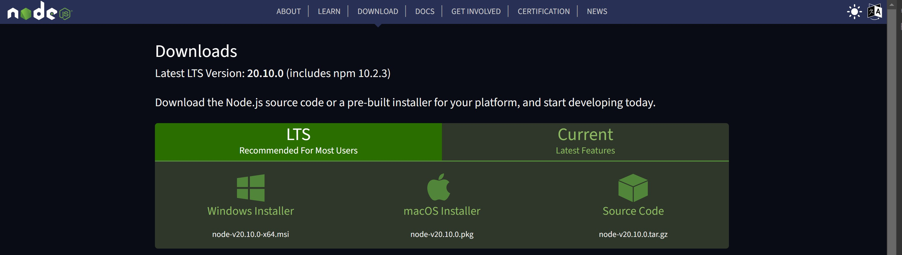
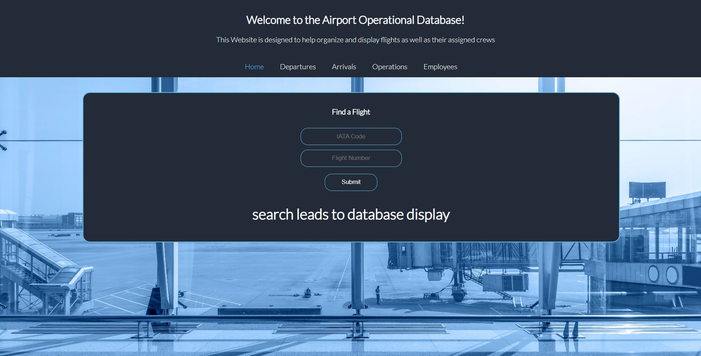
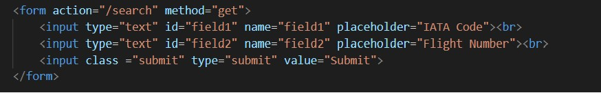
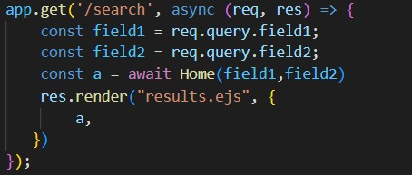
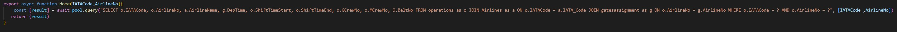

# Data-Management-Final-Project
The Airport Operational Database (AODB) is an advanced relational database system specifically designed for airports. Functioning as more than just a typical airport website, the AODB provides comprehensive and user-friendly access to vital flight information. It offers passengers and airport personnel a seamless, accessible platform to efficiently retrieve and manage their flight-related data.
 
HTML, CSS, JavaScript, MySql, NodeJS and Web services.

## Installation/setup And Execution 
Step 1. Unzip the entire file given in the drop box.  
Step 2. Unzip SQL_input data folder.  
Step 3. Open workbench and create new schema called AODB. 
Step 4. Import all SQL data into workbench. 
Step 5. Open mySQL workbench, and edit connection, note down hostname, username, and remeber your password.    
Step 6. Go to the main unzipped folder, Unzip Data-Management-Finial-project, copy and paste all files from the folder into your Visual Studio Workspace. 
Step 7. Install Node js.  
  
Step 8. Open a new terminal, in that terminal type "nodemon app". 
 
Step 9. Open Google or Firefox 
Step 10. Type in your browser "localhost:6969" 

# Overall Design
The overall design of AODB has two sides to it, the front end and back end. The front end of AODB includes HTML, CSS, Embedded JavaScript and Javascript. The back end includes MySQL, ExpressJS, and NodeJS.

## HTML And CSS
 
Our website encompasses five distinct pages: Home, Departures, Arrivals, Operations, and Employees.  
Each page features a consistent header showcasing navigation options to swiftly access the other sections.
The Home page serves as the main hub, featuring the header and intuitive search boxes facilitating easy flight searches.
 Meanwhile, the Departures and Arrivals pages showcase a comprehensive list comprising of incoming and outcoming flights as well as info regarding flight numbers, destinations, departure times, and statuses, etc.  

Similarily, the Arrivals page mirrors the Departures layout but focuses on incoming flights, displaying relevant details such as flight numbers, origins, arrival times, and statuses. This page also includes a search bar, enhancing the ease of finding specific arrival information.
The Operations page serves as a comprehensive overview of all ongoing airport operations, offering insights into current activities and functions in progress. It provides a centralized space to monitor and understand the operational status of various airport functionalities.
Throughout the website, users can navigate seamlessly between these sections, ensuring a user-friendly experience and easy access to essential flight and operational information.

## JavaScript

<h3>Rest API/JSON</h3>

The Website use a REST API (GET Method) using ExpressJS and NodeJS (server) to obtain data from the database and display it to the frontend. 
<h4>Connecting RestAPI to sql database</h4>
  

uses a form to obtain data with a get method. 
  

  

An SQL Query is generated based on the inputted parameters 

  

## Queries utilizing the Database

  

